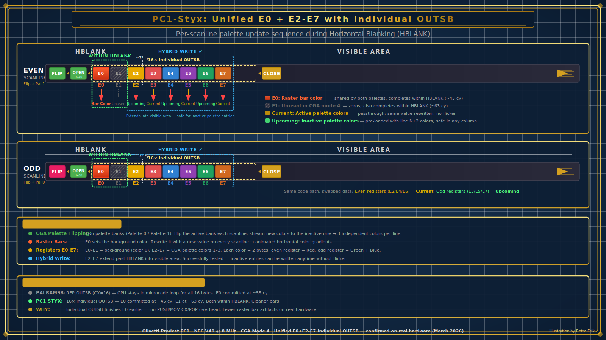
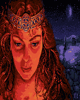
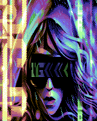
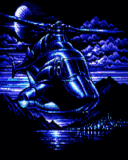

# PC1-Styx

A port of **Styx Remastered** to the Olivetti Prodest PC1's hidden 160×200×16-color graphics mode.

By **Retro Erik** — [YouTube: Retro Hardware and Software](https://www.youtube.com/@RetroErik)


### ▶️ [Watch the gameplay video on YouTube](https://youtu.be/Z3v6KYRCbh4)

### 📥 [Download the complete game (pc1-styx.zip)](pc1-styx.zip)

## About

Styx is a territory-claiming arcade game where the player walks along borders and draws trails to claim territory while avoiding enemies. The original game was developed by Windmill Software in 1983 and used a little-known "tweaked" CGA text mode hack to display all 16 colors at 160×100 resolution — a paltry resolution, but quite effective on CGA monitors and ideal for games of this sort. **Andrew Jenner** later remastered it (1998–2004) as *Styx Remastered*, directly converting the original 160×100×16 graphics rather than redrawing them, and retaining the same resolution and 16-color look while making it run on all PCs with CGA or better.

This port adapts Styx Remastered to run on the **Olivetti Prodest PC1** (and probably other machines with the Yamaha V6355D video chip, such as the Zenith Z-180 and PCs with the ACV-1030 ISA card), taking advantage of the Yamaha V6355D video chip's hidden 160×200×16-color graphics mode — providing 16 colors from a programmable 512-color palette instead of the original CGA's fixed 4-color palette.

## Architecture

<p>
<em>PC1-Styx unified OUTSB startup architecture</em><br>

</p>

## Level Backgrounds

The first three levels use custom background images (320×200 8-bit BMPs):


<br><em>Styx1.bmp — Level 1 background</em>


<br><em>Styx2.bmp — Level 2 background</em>


<br><em>Styx3.bmp — Level 3 background</em>

## What Changed

| Aspect | Styx Remastered (CGA) | PC1 Hidden Mode |
|--------|----------------------|-----------------|
| Startup screen | 320×200×4 RLE-decoded logo | 320×200 BMP with unified per-scanline palette streaming + raster bars |
| Gameplay | 160×100×16 (tweaked CGA text mode) | 160×200×16 |
| Colors | 16 (fixed CGA palette) | 16 (programmable 512-color palette) |
| Pixel format | Character/attribute pairs at B800h | 4bpp, 2 pixels/byte at B000h |
| Mode setup | CRTC register programming | INT 10h mode 4 + port D8h unlock |

### Key modifications

- **Startup screen**: Custom 8-bit BMP viewer using unified per-scanline V6355D palette streaming in 320×200×4 mode — every scanline gets a full E0–E7 palette write (16 bytes via OUTSB), providing 6 independent image colors plus a bar color per scanline from a 512-color palette. Five animated raster bars (“sine snake” — red, yellow, green, cyan, blue gradient bars, each 8 scanlines tall) follow the same sine wave with phase offsets, creating a rainbow snake that slithers behind the STYX title. The sine table range (27–192) keeps bars below the top 27 scanlines. Based on the palram9b approach (confirmed working on real PC1 hardware). Falls back to the original RLE title if `STYX.BMP` is not found.
- **Loading experience**: ANSI splash screen with C64-style border color cycling keeps the display active during both analysis and rendering passes. Off-screen rendering to a RAM buffer keeps the splash visible until the startup screen is ready — no visible blank screen during the transition.
- **Bulk buffered file I/O**: BMP rows are read 10 at a time per DOS call, reducing 400 INT 21h calls to 40 and saving ~1 second of loading time on XT-IDE hardware.
- **VRAM caching**: After the first render, the startup screen is saved to a DOS-allocated 16K memory segment. After game over, the startup screen is restored instantly from cache without re-reading the BMP file from disk.
- All pixel plotting, reading, and masking routines rewritten for 4bpp format
- VRAM segment changed from B800h to B000h
- Hidden mode enable sequence added (port D8h)
- CGA palette programming replaced with V6355D palette via ports DDh/DEh
- CGA snow wait elimination (V6355D has no snow)
- Screen redraw optimized with REP MOVSW block transfers
- 80186 immediate shift instructions used (NEC V40 CPU)
- Key remapping: Space = launch ball, F1 = pause

## Palette Streaming (Startup Screen)

The V6355D has two palette banks (PAL_EVEN and PAL_ODD), each with entries E0–E7. CGA mode 4 maps 2-bit pixel values to these entries. By alternating the active bank at each horizontal blanking interval (HBLANK) and writing new RGB values to the inactive bank, each scanline can display independent colors from the 512-color palette — far beyond CGA's normal 4 fixed colors.

The startup screen renderer uses a **unified per-scanline loop** (based on palram9b, confirmed working on real PC1 hardware). For all 200 visible scanlines, every scanline gets the same treatment:

1. Wait for HBLANK
2. **Flip** the active palette bank (PAL_ODD ↔ PAL_EVEN)
3. Open palette at E0 (`0x40` → port DDh)
4. Stream 16 bytes via OUTSB: E0 (2 bytes, bar/background color) + E1 (2 bytes, unused) + E2–E7 (12 bytes, image colors)
5. Close palette (`0x80` → port DDh)

E0 completes within HBLANK (~55 cycles) so the bar color is glitch-free. E1 spills slightly past HBLANK (harmless — it's unused). E2–E7 write to the inactive bank (flip-first), so image colors are always correct by the time that bank becomes active on the next scanline.

The palette stream is a 3,200-byte buffer (200 scanlines × 16 bytes). Before each frame, `ss_update_stream_e0` patches the E0 slots with raster bar colors from a precomputed scanline color table. E2–E7 slots are set once during BMP analysis and don't change frame-to-frame.

Raster bars use a “sine snake” effect: five gradient bars (red, yellow, green, cyan, blue) follow the same 256-entry sine wave with phase offsets of 12 entries each, creating a rainbow snake that slithers across the screen. Bars are drawn back-to-front (blue tail first, red head last) so the head renders on top when segments overlap. Each bar is 8 scanlines tall with a symmetric gradient (dark → bright → dark). The sine table range (27–192) keeps bars below the top 27 scanlines to avoid the title area.

### Known limitation — E0 race condition

The palette flip (step 2 above) exposes the new E0 value *before* the OUTSB chain (step 4) writes it. On scanlines where E0 is black, this race is invisible. On bar scanlines where E0 holds a non-black color, the stale E0 from the previous flip may briefly flash the wrong color, appearing as an occasional screen blink (~2 per minute). This is cosmetically acceptable and inherent to the flip-first palette streaming architecture.

Building with NASM `-O0` (no jump optimization) inflates the code by ~800 bytes, making near jumps push the OUTSB chain past the HBLANK window and causing constant blinking. Always build with default optimization (or use `-w-error=label-redef-late` to suppress label convergence warnings).

Tunable parameters in the source (`STYX.ASM`):
- `SS_BAR_HEIGHT` — height of each sine-snake gradient bar (default 8)
- `SS_BULK_ROWS` — rows per DOS read call for bulk buffering (default 10)

## Building

Requires [NASM](https://www.nasm.us/) and Python 3.

```
nasm -f bin -w-error=label-redef-late -o STYX.BIN STYX.ASM
python make_exe.py STYX.BIN STYX.EXE
```

## Running

Download [pc1-styx.zip](pc1-styx.zip), extract all files to your Olivetti Prodest PC1 (or compatible system), and run `STYX.EXE` from DOS.

Command-line options (inherited from Styx Remastered):
- `/Q` — Quiet mode (no sound)
- `/S:n` — Set speed (default 100)
- `/N` — No images (disable BMP loading)

## File Structure

| File | Purpose |
|------|---------|
| `STYX.ASM` | Combined NASM source (this gets compiled) |
| `STYX.BMP` | 320×200 8-bit BMP startup image (displayed with CGA palette flip) |
| `make_exe.py` | Converts flat binary to DOS EXE |

The original A86 source files and conversion script have been moved to `Old A86 Source Code/`:

| File | Purpose |
|------|---------|
| `STYX1.ASM` | I/O and graphics routines (A86 original) |
| `STYX2.ASM` | Game logic (A86 original) |
| `STYX3.ASM` | Additional game code (A86 original) |
| `DATA.ASM` | Static data and variables (A86 original) |
| `CODE.ASM` | Shared routines (A86 original) |
| `PARSE.ASM` | Command-line parsing (A86 original) |
| `PARSECMD.C` | Original C parser (compiled to PARSE.ASM) |
| `convert_a86_to_nasm.py` | A86-to-NASM syntax converter (merges the above into STYX.ASM) |

## Credits

- **Andrew Jenner** — Styx Remastered (1998–2004), reverse-engineered and remastered from the original Windmill Software game
- **Retro Erik** — Port to Olivetti Prodest PC1 hidden 160×200×16-color graphics mode

## License

This program is free software under the [GNU General Public License v2](COPYING).

Styx Remastered is Copyright © Andrew Jenner 1998–2004. The original Styx source code and binaries are Copyright © Windmill Software.

---

## YouTube

For more retro computing content, visit my YouTube channel **Retro Hardware and Software**:
[https://www.youtube.com/@RetroErik](https://www.youtube.com/@RetroErik)
